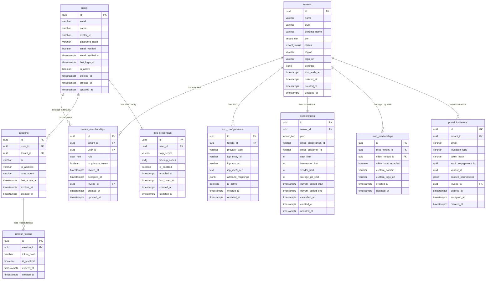
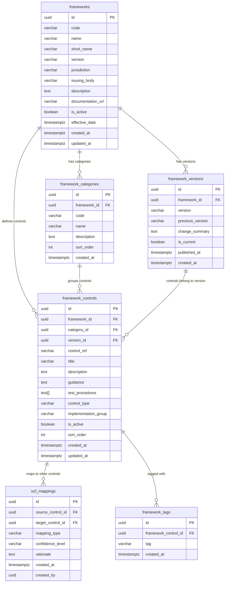
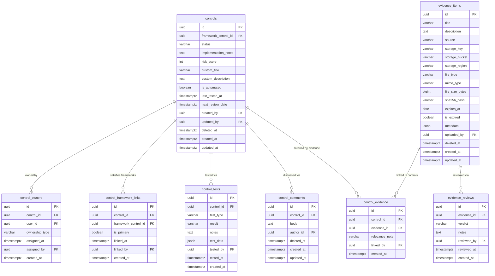
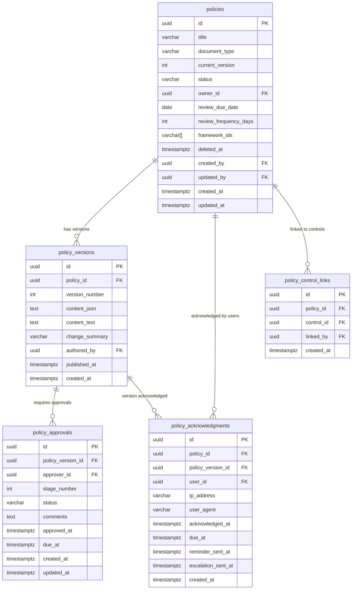
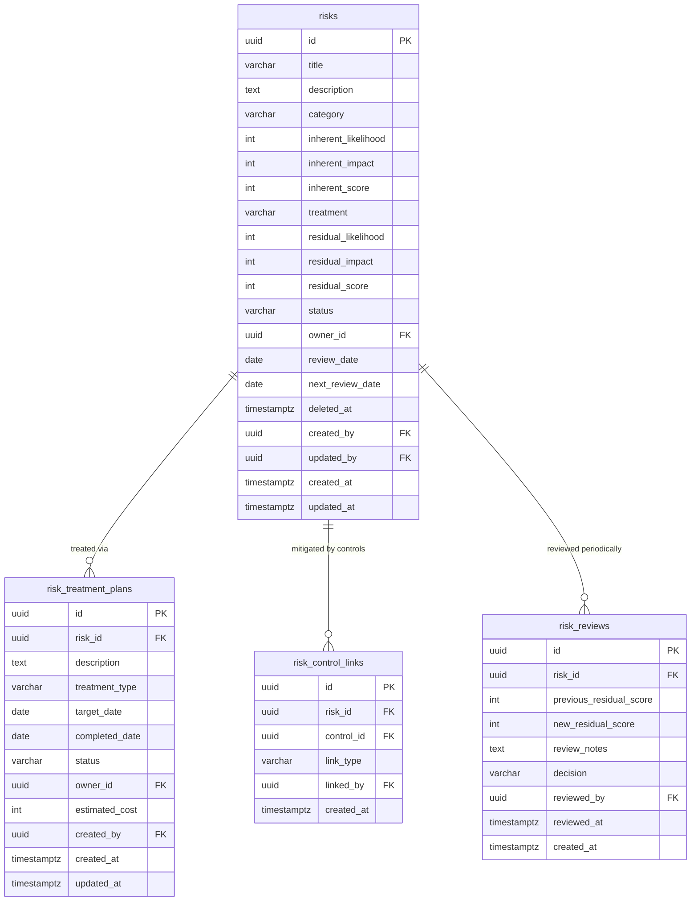
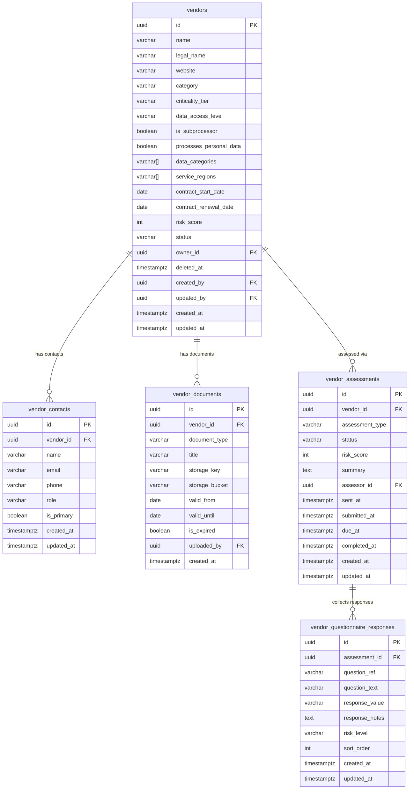
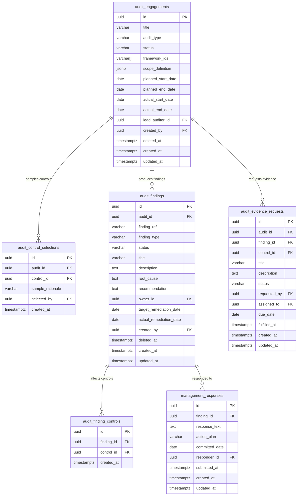
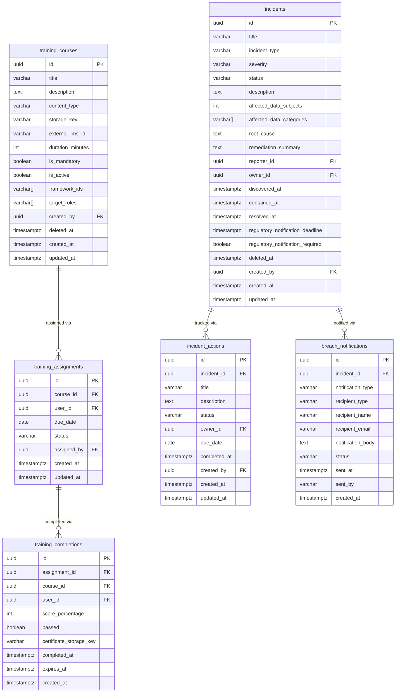
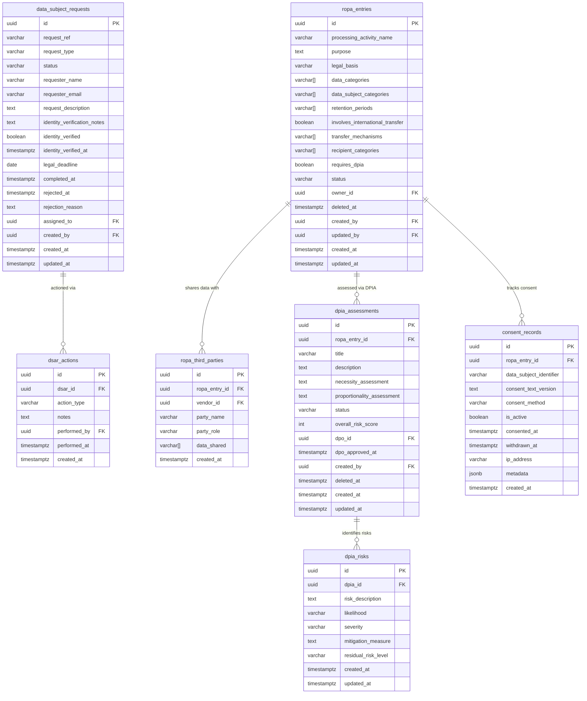
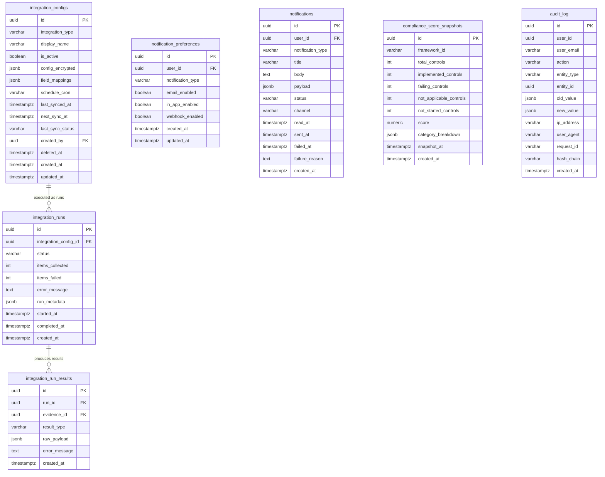

# ComplianceCore — PostgreSQL Database Architecture
### ORION SOFT LIMITED | Database Architect Review | Version 1.0 | June 2026

---

## TABLE OF CONTENTS

1. [Database Design Philosophy](#1-database-design-philosophy)
2. [Schema Organization](#2-schema-organization)
3. [ER Diagrams by Module](#3-er-diagrams-by-module)
   - 3.1 Global & Authentication
   - 3.2 Framework Library (UCF)
   - 3.3 Controls & Evidence
   - 3.4 Policy Management
   - 3.5 Risk Register
   - 3.6 Vendor Risk Management
   - 3.7 Audit Management
   - 3.8 Training & Incidents
   - 3.9 Privacy Management
   - 3.10 Integrations & Analytics
4. [Naming Conventions](#4-naming-conventions)
5. [Standard Column Patterns](#5-standard-column-patterns)
6. [Enum Types Reference](#6-enum-types-reference)
7. [Soft Delete Strategy](#7-soft-delete-strategy)
8. [Audit Log Design](#8-audit-log-design)
9. [Index Strategy](#9-index-strategy)
10. [Constraint Strategy](#10-constraint-strategy)
11. [Performance Optimizations](#11-performance-optimizations)
12. [Prisma Configuration](#12-prisma-configuration)
13. [Multi-Tenancy Implementation](#13-multi-tenancy-implementation)
14. [Table Inventory](#14-table-inventory)

---

## 1. DATABASE DESIGN PHILOSOPHY

### Normalization Target: 3NF with Pragmatic Denormalization

The schema targets **Third Normal Form (3NF)** as its baseline — every non-key attribute depends on the primary key, the whole key, and nothing but the key. Compliance data is relational by nature: a control links to evidence, evidence links to a framework requirement, a framework requirement links to a framework. Trying to force this into a denormalized structure creates update anomalies that are particularly dangerous for a compliance platform (stale control mappings, incorrect risk scores, mislinked evidence).

**Pragmatic denormalization** is applied in exactly two situations:

1. **Derived aggregates for performance:** `compliance_score_snapshots` stores pre-computed scores rather than recalculating over millions of control-evidence relationships on every dashboard request.
2. **Audit log immutability:** The `audit_log` table stores the full JSON snapshot of `old_value` and `new_value` for every mutation rather than re-joining to reconstruct history. This is intentional — if the live data is corrected, the audit log must still accurately show what existed at the time of the event.

### UUID Primary Keys Throughout

All primary keys are `UUID` using `gen_random_uuid()`. Rationale:
- No sequential ID enumeration attacks (an attacker cannot guess `/controls/5` to `/controls/6`)
- Safe for distributed generation — integration workers generating evidence records do not need a DB round-trip to get the next sequence value
- Cross-tenant references in the audit log and MSP console remain globally unique
- Prisma works natively with UUID default values

### Timestamptz, Never Timestamp

Every timestamp column is `TIMESTAMPTZ` (timestamp with time zone). The database stores all times in UTC. Application code never stores a naive local timestamp. This is non-negotiable for a multi-region, multi-jurisdiction compliance platform where regulatory deadlines (72-hour GDPR breach notification) must be timezone-agnostic.

### Foreign Key Discipline

Every relationship that can be expressed as a foreign key, is. No "soft references" via application-layer UUID fields that happen to match another table's ID. PostgreSQL's FK enforcement prevents orphaned evidence records, dangling control owner references, and ghost audit findings. ON DELETE behavior is chosen deliberately per relationship (see Section 10).

---

## 2. SCHEMA ORGANIZATION

```
PostgreSQL Instance
│
├── global                    — Platform-wide data (tenants, auth, billing, MSP)
│   ├── tenants
│   ├── users
│   ├── tenant_memberships
│   ├── sessions
│   ├── refresh_tokens
│   ├── mfa_credentials
│   ├── sso_configurations
│   ├── scim_tokens
│   ├── subscriptions
│   ├── msp_relationships
│   ├── portal_invitations
│   └── global_audit_log
│
├── framework_data            — Immutable reference library (read-only at runtime)
│   ├── frameworks
│   ├── framework_versions
│   ├── framework_categories
│   ├── framework_controls
│   ├── ucf_mappings
│   └── framework_tags
│
└── tenant_{uuid}             — One schema per tenant (provisioned on signup)
    │
    ├── [Config]
    │   └── tenant_settings
    │
    ├── [Controls]
    │   ├── controls
    │   ├── control_owners
    │   ├── control_framework_links
    │   ├── control_tests
    │   └── control_comments
    │
    ├── [Evidence]
    │   ├── evidence_items
    │   ├── control_evidence
    │   └── evidence_reviews
    │
    ├── [Policies]
    │   ├── policies
    │   ├── policy_versions
    │   ├── policy_approvals
    │   ├── policy_acknowledgments
    │   └── policy_control_links
    │
    ├── [Risks]
    │   ├── risks
    │   ├── risk_treatment_plans
    │   ├── risk_control_links
    │   └── risk_reviews
    │
    ├── [Vendors]
    │   ├── vendors
    │   ├── vendor_contacts
    │   ├── vendor_documents
    │   ├── vendor_assessments
    │   └── vendor_questionnaire_responses
    │
    ├── [Audits]
    │   ├── audit_engagements
    │   ├── audit_control_selections
    │   ├── audit_findings
    │   ├── audit_finding_controls
    │   ├── audit_evidence_requests
    │   └── management_responses
    │
    ├── [Training]
    │   ├── training_courses
    │   ├── training_assignments
    │   └── training_completions
    │
    ├── [Incidents]
    │   ├── incidents
    │   ├── incident_actions
    │   └── breach_notifications
    │
    ├── [Privacy]
    │   ├── ropa_entries
    │   ├── ropa_third_parties
    │   ├── data_subject_requests
    │   ├── dsar_actions
    │   ├── dpia_assessments
    │   ├── dpia_risks
    │   └── consent_records
    │
    ├── [Notifications]
    │   ├── notification_preferences
    │   └── notifications
    │
    ├── [Integrations]
    │   ├── integration_configs
    │   ├── integration_runs
    │   └── integration_run_results
    │
    ├── [Analytics]
    │   └── compliance_score_snapshots
    │
    └── [Audit Trail]
        └── audit_log
```

---

## 3. ER DIAGRAMS BY MODULE

### 3.1 Global Schema — Authentication & Tenancy



---

### 3.2 Framework Library (UCF — Universal Control Framework)



---

### 3.3 Controls & Evidence



---

### 3.4 Policy Management



---

### 3.5 Risk Register



---

### 3.6 Vendor Risk Management



---

### 3.7 Audit Management



---

### 3.8 Training & Incidents



---

### 3.9 Privacy Management



---

### 3.10 Integrations, Notifications & Analytics



---

## 4. NAMING CONVENTIONS

| Element | Convention | Example |
|---|---|---|
| Schema | `snake_case` | `global`, `framework_data`, `tenant_abc123` |
| Table | `snake_case`, plural | `controls`, `evidence_items`, `policy_versions` |
| Column | `snake_case` | `created_at`, `framework_control_id`, `risk_score` |
| Primary Key | `id` | `id UUID PRIMARY KEY` |
| Foreign Key | `{referenced_table_singular}_id` | `control_id`, `user_id`, `tenant_id` |
| Index | `idx_{table}_{columns}` | `idx_controls_status`, `idx_evidence_expires_at` |
| Unique Constraint | `uq_{table}_{columns}` | `uq_users_email`, `uq_tenants_slug` |
| Check Constraint | `chk_{table}_{rule}` | `chk_risks_likelihood_range` |
| FK Constraint | `fk_{table}_{column}` | `fk_controls_created_by` |
| Enum Type | `{domain}_{concept}` | `control_status`, `risk_treatment`, `tenant_tier` |
| Trigger | `trg_{table}_{event}` | `trg_controls_updated_at` |
| Function | `fn_{action}_{subject}` | `fn_set_updated_at`, `fn_write_audit_log` |

---

## 5. STANDARD COLUMN PATTERNS

### Full Entity Table (mutable, audited, soft-deletable)
```sql
id              UUID        PRIMARY KEY DEFAULT gen_random_uuid()
-- ... domain columns ...
created_by      UUID        NOT NULL REFERENCES global.users(id)
updated_by      UUID        NOT NULL REFERENCES global.users(id)
deleted_at      TIMESTAMPTZ NULL        -- NULL = active, timestamp = soft-deleted
created_at      TIMESTAMPTZ NOT NULL DEFAULT NOW()
updated_at      TIMESTAMPTZ NOT NULL DEFAULT NOW()
```

### Junction/Link Table (immutable after creation)
```sql
id              UUID        PRIMARY KEY DEFAULT gen_random_uuid()
{entity_a}_id   UUID        NOT NULL REFERENCES {table_a}(id) ON DELETE CASCADE
{entity_b}_id   UUID        NOT NULL REFERENCES {table_b}(id) ON DELETE CASCADE
linked_by       UUID        NOT NULL REFERENCES global.users(id)
created_at      TIMESTAMPTZ NOT NULL DEFAULT NOW()
UNIQUE ({entity_a}_id, {entity_b}_id)
```

### Append-Only Log Table (immutable — no update, no delete)
```sql
id              UUID        PRIMARY KEY DEFAULT gen_random_uuid()
-- ... log columns ...
created_at      TIMESTAMPTZ NOT NULL DEFAULT NOW()
-- No updated_at, no deleted_at, no created_by (uses denormalized user fields)
```

### Reference Data Table (managed by platform — no soft delete)
```sql
id              UUID        PRIMARY KEY DEFAULT gen_random_uuid()
-- ... reference columns ...
is_active       BOOLEAN     NOT NULL DEFAULT TRUE
created_at      TIMESTAMPTZ NOT NULL DEFAULT NOW()
updated_at      TIMESTAMPTZ NOT NULL DEFAULT NOW()
```

---

## 6. ENUM TYPES REFERENCE

All enums are defined once in the `global` schema and referenced across tenant schemas.

| Enum | Values |
|---|---|
| `tenant_tier` | `starter`, `professional`, `enterprise`, `msp` |
| `tenant_status` | `trial`, `active`, `suspended`, `cancelled` |
| `user_role` | `super_admin`, `tenant_admin`, `compliance_manager`, `control_owner`, `auditor_internal`, `auditor_external`, `vendor_external`, `employee`, `executive` |
| `control_status` | `not_started`, `in_progress`, `implemented`, `not_applicable`, `failing` |
| `control_test_result` | `pass`, `fail`, `partial`, `not_tested` |
| `evidence_source` | `manual_upload`, `integration_automated`, `api_push` |
| `policy_status` | `draft`, `in_review`, `approved`, `published`, `archived`, `expired` |
| `policy_type` | `policy`, `procedure`, `standard`, `guideline`, `charter` |
| `risk_category` | `operational`, `regulatory`, `cybersecurity`, `vendor`, `strategic`, `financial`, `reputational` |
| `risk_treatment` | `accept`, `mitigate`, `transfer`, `avoid` |
| `risk_status` | `open`, `in_treatment`, `accepted`, `resolved`, `closed` |
| `vendor_criticality` | `critical`, `high`, `medium`, `low` |
| `vendor_data_access` | `none`, `limited`, `standard`, `elevated`, `administrative` |
| `vendor_status` | `active`, `under_review`, `suspended`, `offboarded` |
| `assessment_status` | `not_started`, `sent`, `in_progress`, `submitted`, `reviewed`, `overdue` |
| `audit_type` | `internal`, `external`, `readiness`, `gap_analysis`, `surveillance` |
| `audit_status` | `planning`, `fieldwork`, `reporting`, `remediation`, `closed` |
| `finding_type` | `observation`, `minor_nonconformity`, `major_nonconformity`, `critical` |
| `finding_status` | `open`, `in_remediation`, `resolved`, `risk_accepted`, `closed` |
| `training_status` | `not_started`, `in_progress`, `completed`, `failed`, `expired` |
| `incident_type` | `data_breach`, `policy_violation`, `control_failure`, `regulatory_query`, `security_incident`, `service_disruption` |
| `incident_severity` | `critical`, `high`, `medium`, `low` |
| `incident_status` | `reported`, `under_investigation`, `contained`, `resolved`, `closed` |
| `dsar_type` | `access`, `deletion`, `rectification`, `portability`, `restriction`, `objection` |
| `dsar_status` | `received`, `identity_pending`, `in_progress`, `completed`, `rejected`, `extended` |
| `integration_type` | `aws`, `azure`, `gcp`, `okta`, `entra_id`, `google_workspace`, `github`, `gitlab`, `jira`, `bamboohr`, `workday`, `jamf`, `intune`, `crowdstrike`, `qualys`, `slack`, `servicenow` |
| `run_status` | `queued`, `running`, `completed`, `failed`, `partial` |
| `notification_channel` | `email`, `in_app`, `webhook`, `slack` |
| `notification_status` | `pending`, `sent`, `delivered`, `failed`, `read` |

---

## 7. SOFT DELETE STRATEGY

All primary entity tables implement soft deletes via a `deleted_at TIMESTAMPTZ` column.

### Rules

1. **Never physically DELETE from entity tables.** Use `UPDATE SET deleted_at = NOW()`.
2. **All standard queries filter `WHERE deleted_at IS NULL`** — enforced at the repository layer.
3. **Unique constraints on soft-deleted tables use partial indexes**, not standard UNIQUE, to allow re-creation of deleted resources:
   ```sql
   -- Allows a new vendor named "Acme" even if one was soft-deleted
   CREATE UNIQUE INDEX uq_vendors_name_active
       ON vendors(name) WHERE deleted_at IS NULL;
   ```
4. **Junction tables do NOT soft-delete** — they use hard DELETE because the link itself is the record. If a control-evidence link is removed, there is no compliance value in retaining that link.
5. **Audit log and append-only tables NEVER soft-delete** — they are immutable by design.
6. **The audit log captures soft-delete events** via the standard audit trigger (action = `'soft_delete'`).

---

## 8. AUDIT LOG DESIGN

### Per-Tenant Audit Log

Every tenant schema contains an `audit_log` table that captures all data mutations within that tenant. This table is:

- **Append-only:** `UPDATE` and `DELETE` privileges are revoked at the database level
- **Hash-chained:** Each row contains a `hash_chain` column — the SHA-256 hash of the previous row's `id || created_at || action`. This creates a tamper-evident chain; any modification to a historical record breaks the chain.
- **Denormalized by intent:** `user_email` is stored alongside `user_id` so the log remains interpretable even if the user record is later deleted.
- **Retained 7 years minimum** via PostgreSQL table partitioning by month (enables efficient archival of old partitions to cold storage).

```
Audit Log Hash Chain:
  Row 1: hash = sha256('genesis')
  Row 2: hash = sha256(row1.id + row1.created_at + row1.action + row1.hash)
  Row 3: hash = sha256(row2.id + row2.created_at + row2.action + row2.hash)
  ...
  Any row deletion or modification invalidates all subsequent hashes — detectable.
```

### Global Audit Log

The `global.global_audit_log` table captures platform-level events:
- Tenant created, suspended, cancelled
- Subscription changes
- SSO configuration changes
- Admin actions by ORION SOFT staff on tenant data

---

## 9. INDEX STRATEGY

### Index Naming and Types

```
Standard B-tree:   idx_{table}_{column(s)}
Partial index:     idx_{table}_{column}_active    (WHERE deleted_at IS NULL)
GIN index:         idx_{table}_{column}_gin       (for arrays, JSONB, full-text)
BRIN index:        idx_{table}_{column}_brin      (for append-only time-series)
Composite:         idx_{table}_{col1}_{col2}      (leftmost column is the filter)
```

### Critical Indexes by Query Pattern

**Tenant Resolution (every API request):**
```sql
-- Looked up on every request to resolve schema name
CREATE UNIQUE INDEX idx_tenants_slug ON global.tenants(slug) WHERE deleted_at IS NULL;
CREATE INDEX idx_tenant_memberships_user ON global.tenant_memberships(user_id);
CREATE INDEX idx_tenant_memberships_tenant ON global.tenant_memberships(tenant_id);
```

**Controls (most-queried entity):**
```sql
-- Dashboard: "show all failing controls"
CREATE INDEX idx_controls_status ON controls(status) WHERE deleted_at IS NULL;
-- Compliance score: count by status
CREATE INDEX idx_controls_status_active ON controls(status) WHERE deleted_at IS NULL;
-- Owner assignment queries
CREATE INDEX idx_control_owners_user ON control_owners(user_id);
CREATE INDEX idx_control_owners_control ON control_owners(control_id);
-- Framework mapping
CREATE INDEX idx_control_framework_links_framework ON control_framework_links(framework_control_id);
-- Review due date alerts
CREATE INDEX idx_controls_review_due ON controls(next_review_date)
    WHERE deleted_at IS NULL AND status != 'not_applicable';
```

**Evidence Expiry (daily scheduled job):**
```sql
CREATE INDEX idx_evidence_expires_at ON evidence_items(expires_at)
    WHERE deleted_at IS NULL AND expires_at IS NOT NULL;
CREATE INDEX idx_evidence_source ON evidence_items(source);
-- Control evidence lookup
CREATE INDEX idx_control_evidence_control ON control_evidence(control_id);
CREATE INDEX idx_control_evidence_evidence ON control_evidence(evidence_id);
```

**Policy Acknowledgments (employee dashboard + compliance score):**
```sql
-- "Who hasn't acknowledged policy X?"
CREATE INDEX idx_policy_acks_policy_user ON policy_acknowledgments(policy_id, user_id);
CREATE INDEX idx_policy_acks_pending ON policy_acknowledgments(policy_id)
    WHERE acknowledged_at IS NULL;
CREATE INDEX idx_policy_acks_due ON policy_acknowledgments(due_at)
    WHERE acknowledged_at IS NULL;
```

**Risk Register (heat map + owner queries):**
```sql
CREATE INDEX idx_risks_residual_score ON risks(residual_score DESC)
    WHERE deleted_at IS NULL;
CREATE INDEX idx_risks_owner ON risks(owner_id) WHERE deleted_at IS NULL;
CREATE INDEX idx_risks_status ON risks(status) WHERE deleted_at IS NULL;
CREATE INDEX idx_risks_category ON risks(category);
```

**Vendor Risk (risk score + criticality):**
```sql
CREATE INDEX idx_vendors_criticality ON vendors(criticality_tier)
    WHERE deleted_at IS NULL;
CREATE INDEX idx_vendors_risk_score ON vendors(risk_score DESC)
    WHERE deleted_at IS NULL;
CREATE INDEX idx_vendor_docs_expiry ON vendor_documents(valid_until)
    WHERE valid_until IS NOT NULL;
```

**Audit Log (compliance investigators):**
```sql
-- Append-only — BRIN is ideal (insert-ordered, very small)
CREATE INDEX idx_audit_log_created_brin ON audit_log USING BRIN (created_at);
-- User activity lookup (for access reviews)
CREATE INDEX idx_audit_log_user_time ON audit_log(user_id, created_at DESC);
-- Entity change history
CREATE INDEX idx_audit_log_entity ON audit_log(entity_type, entity_id);
```

**Notifications (real-time + unread count):**
```sql
CREATE INDEX idx_notifications_user_unread ON notifications(user_id)
    WHERE status != 'read' AND status != 'failed';
CREATE INDEX idx_notifications_user_created ON notifications(user_id, created_at DESC);
```

**Compliance Score Snapshots (trend charts):**
```sql
-- Time-series — BRIN index is optimal
CREATE INDEX idx_score_snapshots_brin ON compliance_score_snapshots
    USING BRIN (snapshot_at);
CREATE INDEX idx_score_snapshots_framework ON compliance_score_snapshots(framework_id, snapshot_at DESC);
```

**DSAR Response Deadlines:**
```sql
CREATE INDEX idx_dsar_deadline ON data_subject_requests(legal_deadline)
    WHERE status NOT IN ('completed', 'rejected');
```

**Incident Regulatory Deadlines:**
```sql
CREATE INDEX idx_incidents_reg_deadline ON incidents(regulatory_notification_deadline)
    WHERE regulatory_notification_required = TRUE
    AND status NOT IN ('resolved', 'closed');
```

---

## 10. CONSTRAINT STRATEGY

### ON DELETE Behavior Rules

| Relationship Type | ON DELETE Behavior | Rationale |
|---|---|---|
| Tenant → everything | RESTRICT | Never cascade-delete an entire tenant's data |
| User (owner/creator) → entity | SET NULL | Entities survive when a user is deleted |
| Control → evidence (junction) | CASCADE | Removing a control removes its evidence links |
| Evidence item itself | SOFT DELETE only | Evidence must be retained for audit history |
| Policy → versions | CASCADE | Deleting a policy archives all its versions |
| Policy → acknowledgments | RESTRICT | Acknowledgments are compliance records — never delete |
| Risk → treatment plans | CASCADE | Treatment plans belong to the risk |
| Vendor → assessments | RESTRICT | Historical assessments must be preserved |
| Audit engagement → findings | RESTRICT | Findings cannot be deleted while audit exists |
| Finding → management responses | RESTRICT | Responses are compliance records |
| Incident → actions | CASCADE | Actions belong to the incident |
| Integration config → runs | SET NULL on config, keep runs | Run history must be preserved even if config is deleted |

### Check Constraints

```sql
-- Risk scores must be within matrix bounds
CONSTRAINT chk_risks_likelihood_range
    CHECK (inherent_likelihood BETWEEN 1 AND 5)
CONSTRAINT chk_risks_impact_range
    CHECK (inherent_impact BETWEEN 1 AND 5)
CONSTRAINT chk_risks_score_calc
    CHECK (inherent_score = inherent_likelihood * inherent_impact)

-- Evidence file size sanity check
CONSTRAINT chk_evidence_file_size
    CHECK (file_size_bytes > 0 AND file_size_bytes <= 524288000) -- 500MB max

-- Policy version must be positive
CONSTRAINT chk_policy_version_positive
    CHECK (version_number > 0)

-- Compliance score must be 0-100
CONSTRAINT chk_score_range
    CHECK (score >= 0 AND score <= 100)

-- DSAR legal deadline must be in the future at creation
-- (enforced at application layer — not a DB constraint due to temporal coupling)

-- Approval stage number must be positive
CONSTRAINT chk_approval_stage_positive
    CHECK (stage_number > 0)

-- Training score must be 0-100 if provided
CONSTRAINT chk_training_score_range
    CHECK (score_percentage IS NULL OR score_percentage BETWEEN 0 AND 100)
```

### Unique Constraints

```sql
-- Global schema
UNIQUE (global.users, email)                              -- one account per email
UNIQUE (global.tenants, slug)                             -- URL-safe tenant identifier
UNIQUE (global.tenant_memberships, tenant_id, user_id)   -- user is a member once per tenant
UNIQUE (global.sso_configurations, tenant_id)             -- one SSO config per tenant
UNIQUE (global.subscriptions, tenant_id)                  -- one subscription per tenant
UNIQUE (global.msp_relationships, msp_tenant_id, client_tenant_id)

-- Framework schema
UNIQUE (framework_data.frameworks, code, version)        -- e.g., 'ISO27001', '2022'
UNIQUE (framework_data.framework_controls, framework_id, control_ref) -- e.g., A.5.1

-- Tenant schema (partial — soft delete aware)
UNIQUE INDEX on controls(framework_control_id) WHERE deleted_at IS NULL  -- one instance per framework control
UNIQUE INDEX on control_evidence(control_id, evidence_id)               -- no duplicate links
UNIQUE INDEX on control_framework_links(control_id, framework_control_id)
UNIQUE INDEX on policy_acknowledgments(policy_id, policy_version_id, user_id)
UNIQUE INDEX on risk_control_links(risk_id, control_id)
UNIQUE INDEX on audit_control_selections(audit_id, control_id)
UNIQUE INDEX on audit_finding_controls(finding_id, control_id)
UNIQUE INDEX on integration_configs(integration_type) WHERE deleted_at IS NULL -- one per type
UNIQUE INDEX on notification_preferences(user_id, notification_type)
```

---

## 11. PERFORMANCE OPTIMIZATIONS

### Table Partitioning

```sql
-- audit_log: partitioned by month (append-only, high volume, long retention)
-- Old partitions (>2 years) can be detached and archived to cold storage
-- without touching the live table structure
CREATE TABLE audit_log (
    -- columns
) PARTITION BY RANGE (created_at);

-- compliance_score_snapshots: partitioned by month
-- Trend queries only need recent partitions; older ones are seldom queried
CREATE TABLE compliance_score_snapshots (
    -- columns
) PARTITION BY RANGE (snapshot_at);
```

### JSONB Columns: When and Why

JSONB is used only for genuinely schemaless or frequently-changing structured data:

| Table | Column | Rationale |
|---|---|---|
| `tenants` | `settings` | UI preferences, feature flags — evolve without migrations |
| `integration_configs` | `config_encrypted` | Each integration type has a different config shape |
| `integration_configs` | `field_mappings` | Configurable per-tenant per-integration |
| `integration_runs` | `run_metadata` | Diagnostic data varies by integration type |
| `audit_log` | `old_value`, `new_value` | Full record snapshots at mutation time |
| `vendor_questionnaire_responses` | (uses typed columns) | Structured enough for typed columns |
| `compliance_score_snapshots` | `category_breakdown` | Variable number of framework categories |

All JSONB columns that need querying have GIN indexes.

### Connection Pooling Configuration (PgBouncer)

```ini
; PgBouncer config for schema-per-tenant architecture
pool_mode = transaction          ; Required for SET search_path per request
max_client_conn = 1000
default_pool_size = 25
min_pool_size = 5
reserve_pool_size = 5
; Each service gets its own pool
; search_path is set per transaction, not per connection
```

**Critical note:** `pool_mode = transaction` is mandatory because `SET search_path` must be issued at the start of every transaction (it resets between transactions in transaction pooling mode). This is handled by a database hook in the repository layer.

### Materialized Views (Phase 2)

When tenant count exceeds 1,000 and dashboard aggregation queries become slow:

```sql
-- Pre-aggregated control status counts per tenant per framework
CREATE MATERIALIZED VIEW mv_control_status_summary AS
SELECT
    framework_control_id,
    status,
    COUNT(*) as control_count
FROM controls
WHERE deleted_at IS NULL
GROUP BY framework_control_id, status;

-- Refresh on: control status changes (via trigger → NOTIFY → worker → REFRESH)
-- Refresh interval: max 5 minutes, triggered by events
```

---

## 12. PRISMA CONFIGURATION

### schema.prisma (key excerpts)

```prisma
generator client {
  provider        = "prisma-client-js"
  previewFeatures = ["multiSchema", "postgresqlExtensions"]
}

datasource db {
  provider   = "postgresql"
  url        = env("DATABASE_URL")
  schemas    = ["global", "framework_data"]
  // Note: tenant schemas are handled via raw queries with SET search_path
  // Prisma multi-schema does not support dynamic schema names
}

// Global schema model example
model Tenant {
  id         String    @id @default(uuid()) @db.Uuid
  name       String
  slug       String    @unique
  schemaName String    @map("schema_name")
  tier       TenantTier
  status     TenantStatus @default(trial)
  createdAt  DateTime  @default(now()) @map("created_at") @db.Timestamptz
  updatedAt  DateTime  @updatedAt @map("updated_at") @db.Timestamptz
  deletedAt  DateTime? @map("deleted_at") @db.Timestamptz

  memberships  TenantMembership[]
  subscription Subscription?

  @@map("tenants")
  @@schema("global")
}
```

### Tenant Schema Approach in Prisma

Prisma's `multiSchema` preview feature supports **static** schema names defined at compile time. Since ComplianceCore uses **dynamic** per-tenant schemas (`tenant_abc123`), tenant schema operations use **Prisma raw queries** with `SET search_path`:

```typescript
// In repository layer — every tenant query uses this pattern
async withTenantSchema<T>(
  tenantSchemaName: string,
  fn: (tx: PrismaClient) => Promise<T>
): Promise<T> {
  return await prisma.$transaction(async (tx) => {
    await tx.$executeRawUnsafe(
      `SET search_path = ${sanitizeSchemaName(tenantSchemaName)}, framework_data, global`
    );
    return await fn(tx);
  });
}
```

The `sanitizeSchemaName` function validates the schema name matches the pattern `tenant_[a-f0-9-]{36}` before interpolation — preventing SQL injection via schema name manipulation.

### Prisma Migrations Strategy

```
prisma/
├── schema.prisma                 # Global + framework_data schemas only
├── migrations/                   # Standard Prisma migrations (global schema)
│   ├── 20270101_global_init/
│   └── 20270102_framework_init/
│
└── tenant-migrations/            # Custom migration runner (not Prisma migrate)
    ├── runner.ts                 # Iterates all tenant schemas, applies SQL files
    ├── 001_tenant_init.sql       # Initial tenant schema template
    ├── 002_add_training.sql      # Additive migration
    └── 003_add_privacy.sql       # Additive migration
```

---

## 13. MULTI-TENANCY IMPLEMENTATION

### Schema Provisioning Sequence

```sql
-- Called once when a new tenant signs up (automated, < 2 seconds)

-- 1. Create the schema
CREATE SCHEMA tenant_550e8400_e29b_41d4_a716_446655440000;

-- 2. Set search path for provisioning
SET search_path = tenant_550e8400_e29b_41d4_a716_446655440000, framework_data, global;

-- 3. Apply all table definitions (from migration runner)
\i tenant-migrations/001_tenant_init.sql

-- 4. Apply all indexes
\i tenant-migrations/001_tenant_indexes.sql

-- 5. Apply triggers (updated_at, audit log)
\i tenant-migrations/001_tenant_triggers.sql

-- 6. Insert default settings
INSERT INTO tenant_settings (key, value) VALUES
    ('timezone', '"UTC"'),
    ('date_format', '"YYYY-MM-DD"'),
    ('evidence_expiry_warning_days', '90'),
    ('policy_review_reminder_days', '30'),
    ('risk_review_frequency_days', '365');

-- 7. Record in global tenant registry
UPDATE global.tenants
SET schema_name = 'tenant_550e8400_e29b_41d4_a716_446655440000',
    status = 'trial'
WHERE id = '550e8400-e29b-41d4-a716-446655440000';
```

### Defense-in-Depth: Row-Level Security as Backstop

In addition to `SET search_path` (primary isolation), each tenant table has RLS enabled as a secondary defense:

```sql
-- Applied to every table in every tenant schema
ALTER TABLE controls ENABLE ROW LEVEL SECURITY;

-- The search_path ensures only the correct schema is visible.
-- RLS ensures that even if search_path is bypassed (bug), the tenant_id check holds.
CREATE POLICY tenant_isolation ON controls
    USING (
        current_setting('app.current_tenant_id', TRUE)::UUID =
        (SELECT tenant_id FROM global.tenants WHERE schema_name = current_schema())
    );
```

---

## 14. TABLE INVENTORY

### Global Schema (12 tables)

| Table | Purpose | Rows at 10K tenants |
|---|---|---|
| `tenants` | Organization registry | 10,000 |
| `users` | Global user identity | ~150,000 |
| `tenant_memberships` | User-tenant role assignments | ~160,000 |
| `sessions` | Active auth sessions | ~50,000 |
| `refresh_tokens` | Secure refresh token store | ~50,000 |
| `mfa_credentials` | TOTP secrets per user | ~150,000 |
| `sso_configurations` | Per-tenant SSO setup | ~2,000 |
| `scim_tokens` | SCIM provisioning tokens | ~2,000 |
| `subscriptions` | Billing plan records | 10,000 |
| `msp_relationships` | MSP → client tenant map | ~1,000 |
| `portal_invitations` | Auditor/vendor invitations | ~500,000 |
| `global_audit_log` | Platform admin events | ~1,000,000 |

### Framework Schema (6 tables)

| Table | Purpose | Approximate Rows |
|---|---|---|
| `frameworks` | Framework definitions | 25 |
| `framework_versions` | Version history | 50 |
| `framework_categories` | Control domains/categories | 400 |
| `framework_controls` | Individual control requirements | 5,000 |
| `ucf_mappings` | Cross-framework control mappings | 15,000 |
| `framework_tags` | Tags on controls | 20,000 |

### Tenant Schema (32 tables — per tenant)

| Module | Tables |
|---|---|
| Config | `tenant_settings` |
| Controls | `controls`, `control_owners`, `control_framework_links`, `control_tests`, `control_comments` |
| Evidence | `evidence_items`, `control_evidence`, `evidence_reviews` |
| Policies | `policies`, `policy_versions`, `policy_approvals`, `policy_acknowledgments`, `policy_control_links` |
| Risks | `risks`, `risk_treatment_plans`, `risk_control_links`, `risk_reviews` |
| Vendors | `vendors`, `vendor_contacts`, `vendor_documents`, `vendor_assessments`, `vendor_questionnaire_responses` |
| Audits | `audit_engagements`, `audit_control_selections`, `audit_findings`, `audit_finding_controls`, `audit_evidence_requests`, `management_responses` |
| Training | `training_courses`, `training_assignments`, `training_completions` |
| Incidents | `incidents`, `incident_actions`, `breach_notifications` |
| Privacy | `ropa_entries`, `ropa_third_parties`, `data_subject_requests`, `dsar_actions`, `dpia_assessments`, `dpia_risks`, `consent_records` |
| Notifications | `notification_preferences`, `notifications` |
| Integrations | `integration_configs`, `integration_runs`, `integration_run_results` |
| Analytics | `compliance_score_snapshots` |
| Audit Trail | `audit_log` |

**Total: 50 tables across 3 schema types**

---

*Document Version: 1.0*
*Author: Database Architect, ORION SOFT LIMITED*
*Classification: CONFIDENTIAL*
*Last Updated: June 15, 2026*

*© 2026 ORION SOFT LIMITED. All rights reserved.*
